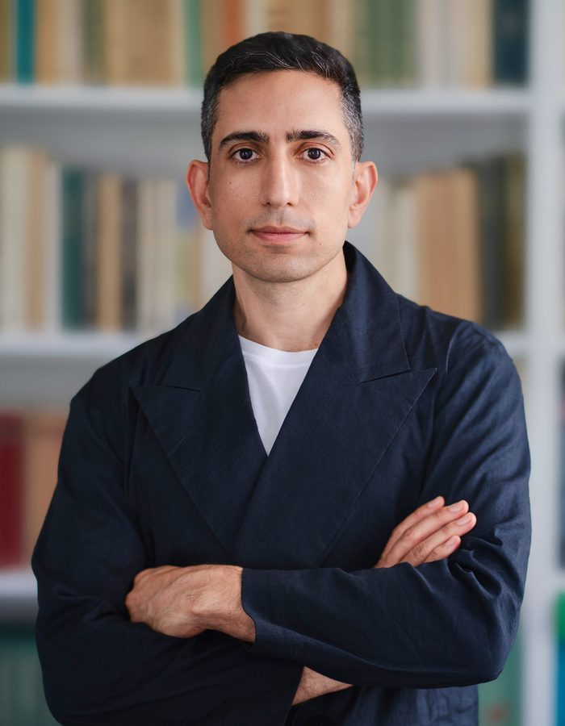

::: {.about-portrait}
{fig-alt="Alexandros Kentikelenis"}

<a href="files/cv/kentikelenis_cv.pdf">⬇ Download CV (PDF)</a>

:::

I am a social scientist working at the intersection of political economy, international relations, and sociology. My research asks two connected questions: how are the rules of the global economy made, and what do they do to people?

## Research

The first strand of my work opens the black box of *decision-making in global governance*. Globalisation means organisation: the integration of markets has been accompanied by a proliferation of rules, norms, and bureaucracies governing the activities of states, firms, and citizens. I study how these rules emerge, who writes them and how they are contested. My research also reveals how political pressures and expert knowledge interact in producing the policy scripts that international organisations promote around the world. Much of this work relies on original data that make otherwise opaque institutions open to systematic analysis. 

The second strand of my research examines the *consequences of globally devised policies for health and social protection*. My early work on the Greek crisis was among the first to document how austerity was damaging population health. This developed into a comparative programme built around the most comprehensive dataset of policy conditions attached to IMF agreements (developed with Thomas Stubbs and available on [www.imfmonitor.org](https://www.imfmonitor.org/)). The findings show how these reforms can weaken state capacity, increase corruption, and widen income and health inequalities. More recently, I have examined the development and impact of policies underpinning the global green transition and health system preparedness. 

Across these projects, I combine archival research, quantitative methods, computational text analysis and interviews. Overall, the different strands of my work have attracted more than €1 million in research funding.

## Policy engagement

I treat research and policy as closely connected. I have presented my findings at the IMF-World Bank Annual and Spring Meetings, the G20 Working Group on International Monetary Architecture, the UN Human Rights Council and the European Parliament, and have produced policy research for the World Health Organization, Oxfam International, the Recourse Foundation and the Foundation for European Progressive Studies. I serve on the Lancet Commission on Global Governance for Health and on the WHO’s expert group on the economics of health and wellbeing. From 2020 to 2024, I was Vice-President of Greece’s National Centre for Social Solidarity. 

## Academic leadership and service

At Bocconi, I direct the [PhD Programme in Social and Political Sciences](https://www.unibocconi.it/en/programs/phd/phd-social-and-political-science), with responsibility for its academic development, admissions, doctoral training, mentoring and placement. I also coordinate the Politics and the Welfare State research unit at the [Dondena Centre for Research on Social Dynamics and Public Policy](https://dondena.unibocconi.eu/research/research-units/politics-and-welfare-state), an interdisciplinary group bringing together scholars working on political decision-making, public policy, inequality and social protection.

A further part of my institutional work takes place through [CIVICA](https://www.civica.eu/), the European University Alliance of leading social science institutions. I oversee Master’s-level activities across the alliance, including multi-campus courses, intensive seminars, digital mobility and jointly delivered teaching. I also represent Bocconi on CIVICA’s scientific committee, which develops collaborative research, faculty-mobility and funding initiatives across its member institutions.

Beyond Bocconi, I contribute to the wider academic community through editorial, funding-evaluation, and advisory roles. I serve on the editorial boards of several journals, evaluate scholarship applications for the [Onassis Foundation](https://www.onassis.org/initiatives/scholarships), and sit on the advisory board of the [History and Political Economy Project](https://www.hpeproject.org/). 

