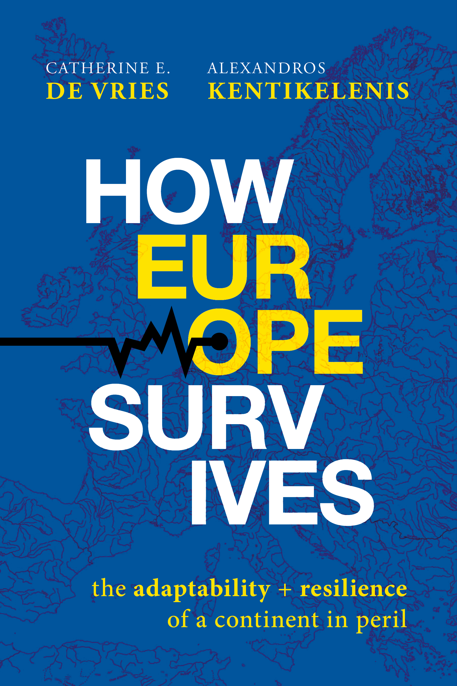
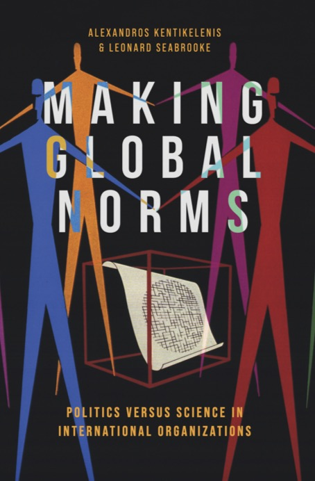
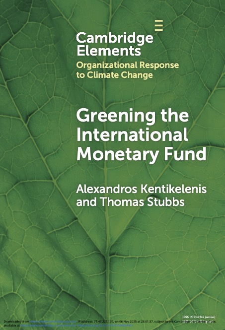
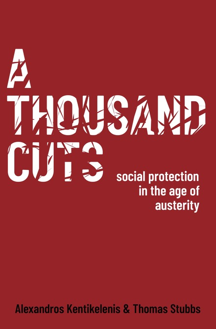

<!-- To replace a cover: drop a JPG (roughly 600 × 900 px) into files/covers/ with the same filename. -->

::: {.book}
{fig-alt="Cover of How Europe Survives"}

<h3>How Europe Survives: The Adaptability and Resilience of a Continent in Peril</h3>

With Catherine E. De Vries · 2026 · [Oxford University Press](https://global.oup.com/academic/product/how-europe-survives-9780197908051) (code AUFLY30 for 30% off)

<em>How Europe Survives: The Adaptability and Resilience of a Continent in Peril</em> challenges the familiar narrative of European decline and perpetual crisis. Instead of treating the EU as a machine in need of constant repair or as a project forever on the verge of collapse, the book reframes Europe as a living organism: imperfect, evolving, and capable of absorbing shocks without breaking apart. Building on a sweeping reinterpretation of European integration from the post-war decades to the turbulence of the 2020s, <em>How Europe Survives</em> argues that the EU’s hallmark features—its multiple veto points, overlapping institutions, and endless negotiations—are surprising sources of resilience that have repeatedly confounded predictions of collapse.

Praise

<blockquote>“A timely and thought-provoking reflection on the continent’s past, present and future. An essential read for defenders of Europe.” — <em>Enrico Letta, former prime minister of Italy</em></blockquote>
<blockquote>“Lately it has been very popular to bash Europe and criticise its lack of action in an increasingly turbulent world. This book by de Vries and Kentikelenis offers a different perspective. It shows that the European Union, since its creation, has indeed been a very adaptive organism and has remained resilient throughout decades of crises because of its flexibility. Therefore, also in this era of polycrisis, there is hope—if there is enough political will.” — <em>Cecilia Malmström, former European Commissioner for Trade, and for Home Affairs</em></blockquote>
<blockquote>“European integration has been under strain for years, facing shock after shock. De Vries and Kentikelenis invite the reader to explore different dimensions of this crisis, including geopolitical and social. They rebut the habitual doomsayers not through citations of institutional optimism but by highlighting the EU’s adaptive strength and its genuine chance to build effective sovereignty.” — <em>László Andor, former European Commissioner for Employment, Social Affairs and Inclusion</em></blockquote>
<blockquote>“This is one of the most original and compelling books on Europe’s future in years. De Vries and Kentikelenis move beyond the tired opposition between European decline and federalist salvation to offer a new way of thinking about the Union. By recasting Europe as an adaptive organism, they illuminate how conflict, compromise and imperfection can become sources of resilience. A brilliant and accessible account for anyone concerned with the European project.” — <em>Kalypso Nicolaïdis, European University Institute</em></blockquote>
<blockquote>“De Vries and Kentikelenis explain how Europe has adapted to survive, and why today’s security and economic challenges will demand more than muddling through. A bracing and timely agenda for action, and essential reading for scholars and practitioners alike.” — <em>Simon Hix, London School of Economics</em></blockquote>
<blockquote>“Too much has been written about the EU against an unrealistic template — one that sets the bar so high the institution is declared dead or irrelevant with exhausting regularity. <em>How Europe Survives</em> offers a brilliant corrective: an account of how the EU endures—imperfectly, but durably—that recalibrates the very yardsticks by which we judge it.” — <em>Stephanie C. Hofmann, Graduate Institute of International and Development Studies</em></blockquote>
<blockquote>“This is exactly the book we need right now. De Vries and Kentikelenis compellingly show how the complexity, imperfections, and resilience of the European Union are a feature not a bug—and surprising sources of strength and adaptation in today’s challenging world. This creative and deeply thoughtful book is a must-read for anyone interested in a more prosperous, secure, and democratic Europe.” — <em>Kathleen R. McNamara, Georgetown University</em></blockquote>

 
:::

::: {.book}
{fig-alt="Cover of Making Global Norms"}

<h3>Making Global Norms: Politics versus Science in International Organizations</h3>

With Leonard Seabrooke · 2025 · [Oxford University Press](https://global.oup.com/academic/product/making-global-norms-9780197828625) (code AUFLY30 for 30% off)

<a href="files/books/making-global-norms.pdf" style="display:inline-block;padding:5px 14px;border-radius:3px;margin:0 8px 6px 0;font-family:Menlo,Consolas,monospace;font-size:0.72rem;letter-spacing:0.04em;text-transform:uppercase;color:#fff;text-decoration:none;background:#3730A3;">Open Access PDF</a>

Award Best Book on International Law and Social Science, American Society of International Law, 2026

<em>Making Global Norms: Politics versus Science in International Organizations</em> shows how the rules of economic and political globalisation are made inside international organisations. Rather than treating ‘global norms’ as abstract principles that simply diffuse, the book foregrounds the practical work of turning contested ideas into actionable ‘policy scripts’—the templates that define problems, specify solutions, and travel across countries. Drawing on a new theoretical framework and methodological toolkit, <em>Making Global Norms</em> argues that norm-making is shaped by the ongoing tension between politics and expertise. Empirically, the book traces how policy scripts on sovereign debt management, capital controls, and taxation were negotiated and codified.

Praise

<blockquote>“The book stands out for its ability to combine an interest in broad questions about norm change, international organizations and the role of expertise in international politics with in-depth empirical work that brings out the particular norm dynamics, the actors involved in norm-making processes as well as their approaches and worldviews. <em>Making Global Norms</em> makes a significant contribution to our understanding of the dynamics of international law and norms by drawing on historical, sociological and political science methods and literatures with a rare sophistication.” — <em>Laudation by the award committee for the Best Book in International Law and Social Science, American Society of International Law</em></blockquote>
<blockquote>“Kentikelenis and Seabrooke have written an excellent book. They have given international relations a new theory for conceptualizing the agency of international organizations.” — <em>Review by Jeffrey T. Checkel (European University Institute) in Perspectives on Politics</em></blockquote>
<blockquote>“<em>Making Global Norms</em> is an ambitious book, with nuanced arguments and a wealth of data, and will be important reading for both scholars of international cooperation and those of bureaucratic politics more broadly. It should further serve as a strong foundation for future research.” — <em>Review by Noah Zucker (Princeton University) in Review of International Organizations</em></blockquote>
<blockquote>“Ultimately, this is a book about the people who make international organisations function. By demonstrating that global norms are not simply shaped by national voting alliances or by technocrats, Kentikelenis and Seabrooke provide an important new way of understanding the determinants of policy preferences.” — <em>Review by Robyn Klingler-Vidra (King's College, London) in Global Policy</em></blockquote>

Reviewed in <a href="https://doi.org/10.1017/S1537592726105726">Perspectives on Politics</a>

Reviewed in <a href="https://www.globalpolicyjournal.com/blog/19/08/2026/book-review-making-global-norms-politics-versus-science-international-organizations">Global Policy</a>

Reviewed in <a href="https://doi.org/10.1007/s11558-026-09643-5">Review of International Organizations</a>

:::

::: {.book}
{fig-alt="Cover of Greening the International Monetary Fund"}

<h3>Greening the International Monetary Fund</h3>

With Thomas Stubbs · 2025 · [Cambridge University Press](https://www.cambridge.org/core_title/gb/626425) · Elements in Organizational Responses to Climate Change

<a href="files/books/greening-the-imf.pdf" style="display:inline-block;padding:5px 14px;border-radius:3px;margin:0 8px 6px 0;font-family:Menlo,Consolas,monospace;font-size:0.72rem;letter-spacing:0.04em;text-transform:uppercase;color:#fff;text-decoration:none;background:#3730A3;">Open Access PDF</a><a href="https://doi.org/10.7910/DVN/8BSKWO" style="display:inline-block;padding:5px 14px;border-radius:3px;margin:0 8px 6px 0;font-family:Menlo,Consolas,monospace;font-size:0.72rem;letter-spacing:0.04em;text-transform:uppercase;color:#fff;text-decoration:none;background:#6366F1;">Replication data</a>

The IMF has emerged as a key player in climate policy, and this closer engagement with the economic dimensions of climate change holds the promise of helping countries preempt large-scale economic dislocations from climate risks. But how much progress has the IMF made in supporting the green transition and what is the policy track record of its climate loans and policy advice? Based on extensive new evidence, <em>Greening the International Monetary Fund</em> points to the multifaceted, and at times contradictory, ways green transition objectives have become embedded within IMF activities.

:::

::: {.book}
{fig-alt="Cover of A Thousand Cuts"}

<h3>A Thousand Cuts: Social Protection in the Age of Austerity</h3>

With Thomas Stubbs · 2023 · [Oxford University Press](https://global.oup.com/academic/product/a-thousand-cuts-9780190637736) (code AUFLY30 for 30% off)

<a href="https://doi.org/10.7910/DVN/DPV99L" style="display:inline-block;padding:5px 14px;border-radius:3px;margin:0 8px 6px 0;font-family:Menlo,Consolas,monospace;font-size:0.72rem;letter-spacing:0.04em;text-transform:uppercase;color:#fff;text-decoration:none;background:#6366F1;">Replication data</a>

<em>A Thousand Cuts: Social Protection in the Age of Austerity</em> provides a comprehensive analysis of IMF policies around the world. Based on novel data from the IMF archives, the book offers a replicable database of all IMF-mandated reforms from 1980-2019, and examines their effects on social policies and outcomes. The analysis reveals that although the precise content of IMF-mandated austerity has changed, the organisation continues to place a high burden of reform on its borrowers. These reforms decrease the availability of important social services and contribute to rises in income inequality and declines in population health.

Praise

<blockquote>“<em>A Thousand Cuts</em> is the most significant piece of research on austerity's pernicious effects in the Global South. Alexandros Kentikelenis and Thomas Stubbs meticulously demonstrate that budget cuts fail poorer countries time and time again. This is essential reading for anyone concerned with how the world can avoid economic mistakes of the past, and how governments can implement policies that promote social protection.” — <em>Mark Blyth, The William R. Rhodes '57 Professor of International Economics, Brown University</em></blockquote>
<blockquote>“This carefully researched book examines more than 6,000 IMF loan documents over four decades to show convincingly that IMF conditionalities still require regressive public policies that in turn have regressive socio-economic outcomes. Such an important book must be read carefully in every national capital, and most of all in Washington, D.C. It forms the basis for arguments for major change if the IMF is to be fit for purpose in the contemporary world economy.” — <em>Jayati Ghosh, Professor of Economics, University of Massachusetts - Amherst</em></blockquote>
<blockquote>“In brilliant, novel detail, <em>A Thousand Cuts</em> provides a devastating indictment of the IMF's austerity-driven conditionality and its systemic undermining of social policies and outcomes. It should be required reading not just for scholars and policy activists, but also for IMF staff intent on substantively changing the institution's practices.” — <em>Daniela Gabor, Professor of Economics, School of Oriental and African Studies</em></blockquote>
<blockquote>“<em>A Thousand Cuts</em> is the first comprehensive, data-driven analysis of the outcomes of IMF lending policies. While the methodology is rigorous and writing style elegant, the conclusions are not pretty. Kentikelenis and Stubbs document the consistently devastating social consequences of ill-conceived austerity measures by the IMF. This truly original and alarming new volume is mandatory reading for anyone interested in how to build a more progressive global economic governance based on evidence over ideology.” — <em>Kevin P. Gallagher, Director of the Global Development Policy Center, Boston University</em></blockquote>
<blockquote>“The book weaves together a sobering analysis with a lucid and historically contextualizing narrative. It should serve as inspiration, both for researchers who want to develop and communicate robust evidence on the financial institutions that make our world, and for the policy-makers and activists who wish to transform them.” — <em>Review by Rosie Collington in International Affairs</em></blockquote>

Reviewed in <a href="https://doi.org/10.1093/ia/iiae111">International Affairs</a>

Reviewed in <a href="https://doi.org/10.1080/00220388.2024.2350777">Journal of Development Studies</a>

Reviewed in <a href="https://doi.org/10.1111/1475-4932.12825">Economic Record</a>

Reviewed in <a href="https://doi.org/10.1007/s10991-024-09375-9">Liverpool Law Review</a>

Reviewed in <a href="https://www.pw-portal.de/demokratie-und-frieden/ueberblick/alexandros-kentikelenis-thomas-stubbs-a-thousand-cuts-social-protection-in-the-age-of-austerity">Portal für Politikwissenschaft</a>

<!-- A Thousand Cuts PDF is at files/books/a-thousand-cuts.pdf if you decide to link it:
     add · [PDF](files/books/a-thousand-cuts.pdf) to the book-links line above. -->

:::

## In preparation

**The Making of the Washington Consensus.** With Sarah Babb. Drawing on thousands of newly declassified documents from the US, UK, IMF, and World Bank archives, this book provides the history of how a set of contested ideas about markets and states became the operating code of the international financial institutions in the 1980s.
